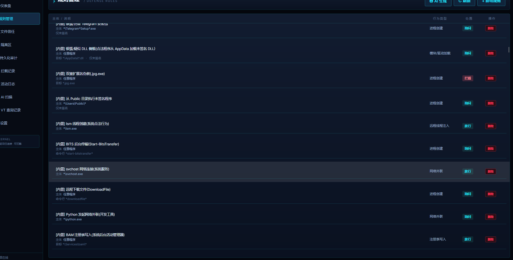
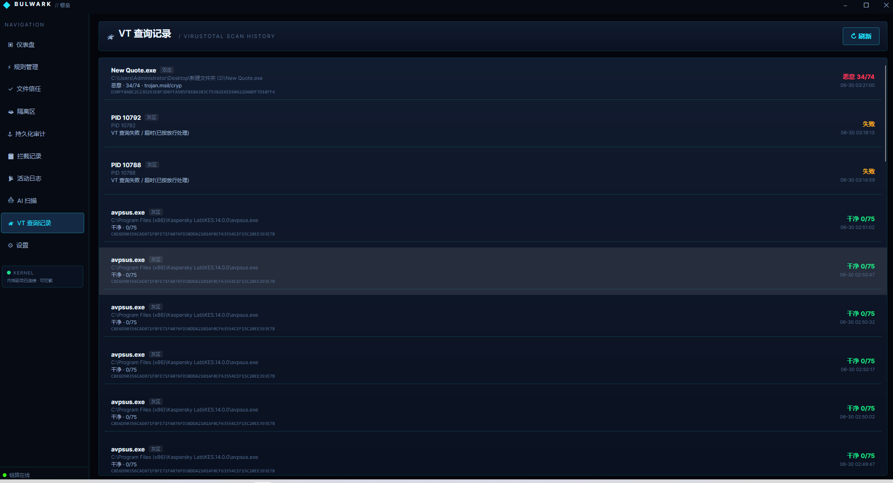
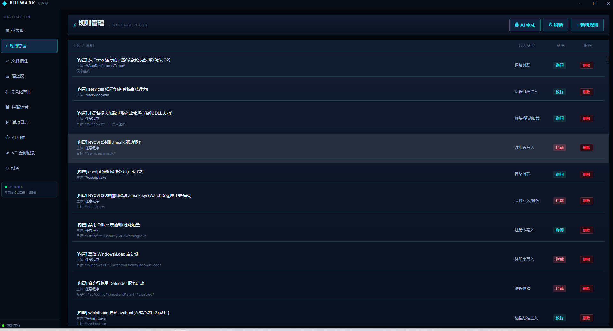
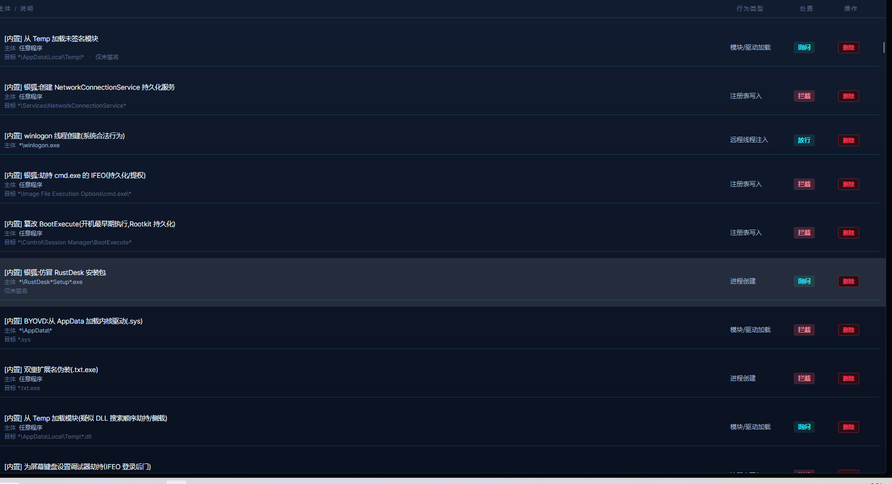
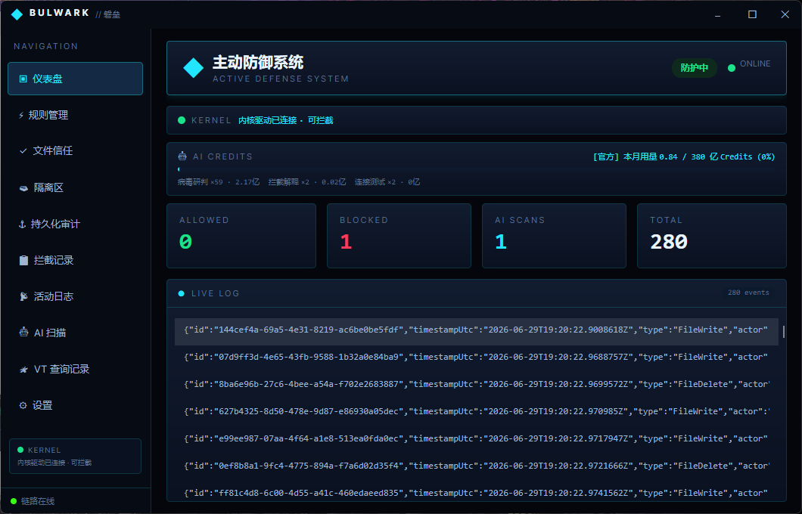
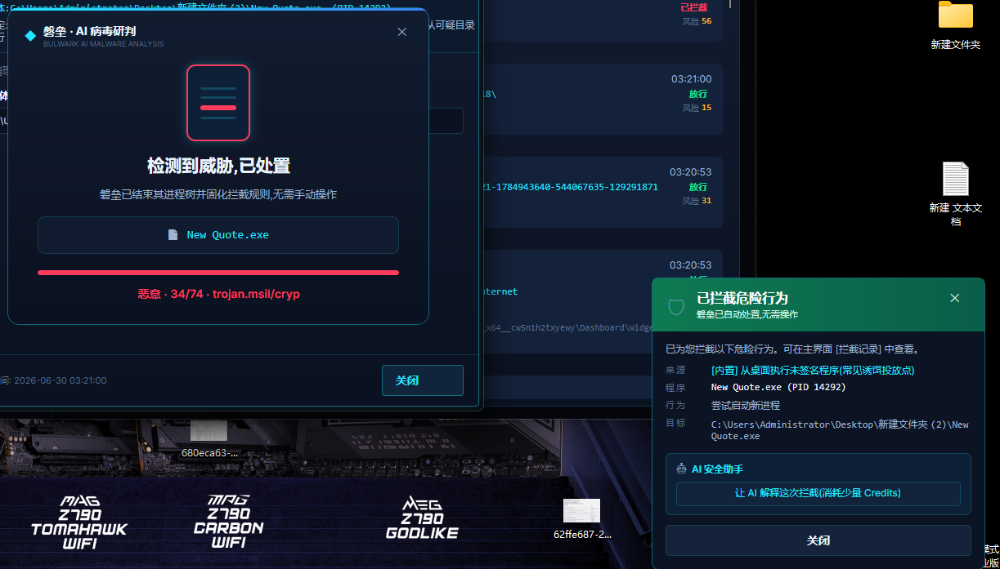
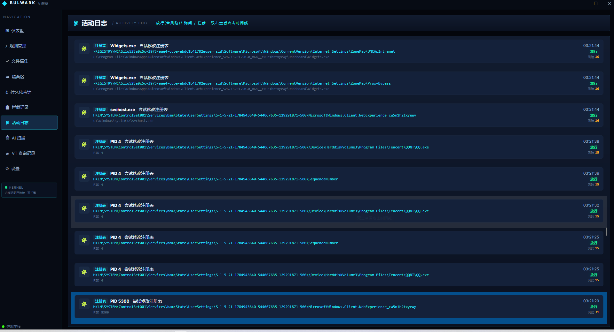
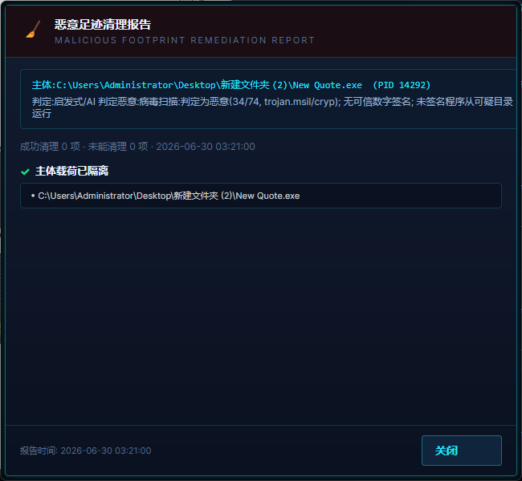
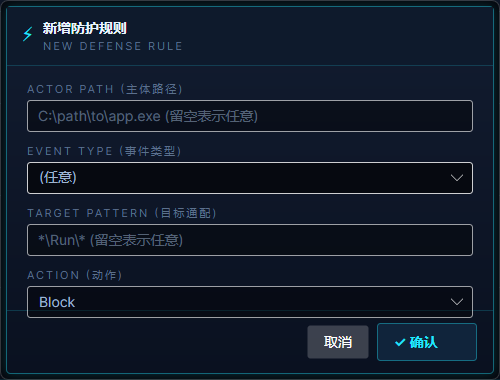
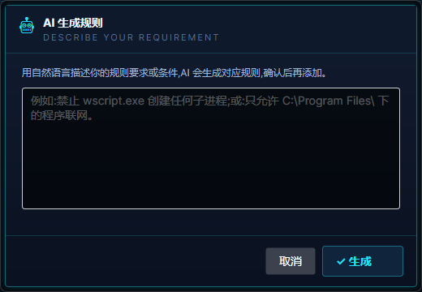

# 磐垒主动防御(Bulwark)

简体中文 | [English](README.en.md)

一个类似磐垒的主机入侵防御(HIPS)软件骨架。核心思路:**监控系统敏感行为 → 规则引擎决策 → 必要时弹窗让用户裁决(允许/阻止/记住)**。

磐垒采用三层协作架构:**内核态驱动(R0)** 负责真正的「行为发生前」拦截,**用户态 Windows 服务(R3)** 承载决策逻辑,**Avalonia 桌面 UI** 负责状态展示、实时日志、行为弹窗与规则管理。驱动 ↔ 服务经 Filter Manager 通信端口对话,服务 ↔ UI 经命名管道对话。无论事件来自哪个事件源,统一由一个 `RuleEngine` 作为决策中心,并由威胁启发式、LOLBin 白利用检测、MITRE ATT&CK 标注、凭据访问检测与多引擎哈希信誉共同增强。

> 当前进度:已打通 `内核驱动(R0) ↔ 用户态服务(R3) ↔ UI` 完整链路,**六个防护里程碑(M1–M6)全部完成**。
> - **M1+**:服务↔UI 链路、WMI 真实进程观测、Authenticode 签名校验、SHA-256、规则管理、服务安装。
> - **M2–M6(内核驱动)**:进程拦截、文件防护、注册表防护、自我保护、网络外联拦截。驱动已能编译产出 `Bulwark.sys`,详见 `Bulwark.Driver/README.md`。

> 三种事件源可切换(appsettings.json 的 `EventSource`):`Driver`(内核拦截,含全部 M2–M6)、`Wmi`(用户态观测)、`Simulated`(演示)。

## 截图

| | |
|:---:|:---:|
|  |  |
|  |  |
|  |  |
|  |  |
|  |  |

## 解决方案结构

```
Bulwark.sln
├─ Bulwark.Core      共享层:事件模型、裁决、规则、规则引擎、IPC 协议
│   ├─ Models/          SecurityEvent / Verdict / DefenseRule / Evidence(证据链)
│   ├─ Engine/          RuleEngine(决策中心)+ ThreatDetector / LolbinAnalyzer(白利用)
│   │                   / KillChainAnalyzer / AttackCatalog + AttackAnnotator(ATT&CK 标注)等
│   └─ Ipc/             IpcMessage(命名管道消息协议)
├─ Bulwark.Driver    内核驱动(R0):进程创建拦截 + Filter Manager 通信端口
│   ├─ Driver.c         DriverEntry / Minifilter 注册
│   ├─ ProcessMonitor.c PsSetCreateProcessNotifyRoutineEx 拦截
│   ├─ Comms.c          通信端口 + FltSendMessage 等待裁决
│   └─ Protocol.h       内核↔服务消息结构
├─ Bulwark.Service   用户态服务(R3):决策宿主 + 命名管道服务端
│   ├─ Ipc/             IpcServer
│   ├─ Driver/          FilterApi(fltlib P/Invoke) + DriverStructs(布局对应 Protocol.h)
│   ├─ Monitoring/      IEventSource 三实现:DriverEventSource(内核拦截)
│   │                   / WmiProcessEventSource(观测) / SimulatedEventSource(演示)
│   │                   + ProcessInspector(签名/哈希) + IVerdictSink(裁决回写)
│   ├─ Storage/         RuleStore(规则 JSON 持久化)
│   ├─ BulwarkOptions.cs  配置(事件源/信任策略/超时)
│   └─ Worker.cs        主防御循环
└─ Bulwark.UI.Scifi  Avalonia 界面(科幻风):状态、实时日志、行为弹窗、规则管理
    ├─ Services/        IpcClient / TrayManager
    ├─ Views/           MainWindow 主窗口 + Dashboard/InterceptLog/Rules/Quarantine/Settings/Trust 页
    ├─ PromptWindow     行为询问弹窗(允许/阻止/记住)
    ├─ RulesPage        规则管理(查看/刷新/删除)
    └─ app.manifest     请求管理员权限

scripts/
├─ build-driver.ps1      编译内核驱动(WDK)
├─ deploy-driver-vm.ps1  在测试虚拟机里签名/安装/启动驱动
├─ install-service.ps1   发布并注册为 Windows 服务(管理员)
└─ uninstall-service.ps1 停止并删除服务(管理员)
```

## 配置(appsettings.json 的 Bulwark 节)

```jsonc
{
  "Bulwark": {
    "EventSource": "Wmi",        // Driver=内核拦截 / Wmi=用户态观测 / Simulated=演示
    "TrustSignedActors": true,    // 自动放行带可信签名的程序
    "DefaultAction": "Allow",     // 无规则/超时兜底:Allow 或 Block
    "PromptTimeoutSeconds": 30,   // 弹窗等待超时
    "ProtectedPaths": [           // 仅 Driver 模式生效:受保护文件路径(子串匹配)
      "\\Bulwark_Protected\\"
    ],
    "ProtectedRegistryKeys": [    // 仅 Driver 模式生效:受保护注册表键(子串匹配)
      "\\CurrentVersion\\Run"
    ],
    "BlockedRemoteEndpoints": [   // 仅 Driver 模式生效:网络黑名单(IP 或 IP:端口)
      "203.0.113.66:443"
    ]
  }
}
```

## 运行(开发调试)

真实进程监控(WMI)需要**管理员权限**。需要两个终端,先启动服务,再启动 UI,**两者都用管理员身份运行**:

```powershell
# 终端 1:启动服务(控制台模式调试运行)
dotnet run --project Bulwark.Service

# 终端 2:启动 UI(manifest 已声明 requireAdministrator)
dotnet run --project Bulwark.UI.Scifi
```

UI 顶部状态点变绿表示已连接服务。现在每当系统有**真实进程启动**:
- 带可信签名的进程 → 引擎自动放行,直接出现在日志;
- 无签名的进程 → 弹窗让你选择「允许 / 阻止」,可勾选「记住我的选择」生成持久规则。

点「规则管理」可查看/删除已保存的规则。规则持久化在 `%ProgramData%\Bulwark\rules.json`。

> 想先看演示而不监控真实进程,把 `appsettings.json` 的 `EventSource` 改为 `"Simulated"`。

## 界面功能与使用方法

UI 左侧导航共 10 个页面,顶部状态点变绿(链路在线)表示已连接服务。

### ▣ 仪表盘(Dashboard)
总览页,纯展示无需操作。包含:顶部「防护中 / 未连接服务」状态横幅与 ONLINE/OFFLINE 指示;**KERNEL** 行显示内核驱动连接状态与文案;**AI CREDITS** 月度用量进度条(优先显示小米平台官方用量,否则本地估算,并列出各 AI 功能的调用次数/Credits 分项);四张统计卡片 **ALLOWED / BLOCKED / AI SCANS / TOTAL**;底部 **LIVE LOG** 实时滚动被处置的进程/文件/注册表/网络事件。

### ⚡ 规则管理(Rules)
查看与管理防御规则。每行显示:规则说明、主体、命中条件、状态标签(临时/会话/停用)、行为类型、处置(拦截=红 / 放行·询问=青)。操作:
- **+ 新增规则** — 打开规则编辑器手动新建。
- **🤖 AI 生成** — 用自然语言描述需求(如「禁止 wscript 创建子进程」),AI 给出 1~5 条建议规则,逐条点 **采纳** 加入。
- **↻ 刷新** / 每行 **删除**。
- 提示:在行为弹窗里勾选「记住选择」也会自动生成规则。

### ✓ 文件信任(Trust)
受信任程序名单,名单内程序的行为直接放行。操作:**+ 添加信任** 选择可执行文件、每行 **移除**、**↻ 刷新**。每行显示文件路径与备注。

### 🗃 隔离区(Quarantine)
被确认恶意并隔离的文件。列:FILE(文件名+原路径)/ REASON(原因)/ DATE(隔离时间)/ OPS。操作:**还原**(恢复到原位置)、**删除**(永久删除)、**↻ 刷新**。

### ⚓ 持久化审计(Persistence)
点 **↻ 扫描** 只读枚举七类自启动持久化点:注册表 Run/RunOnce、启动文件夹、Windows 服务、计划任务、映像劫持(IFEO)、Winlogon、AppInit_DLLs。每行显示类别、名称、命令、位置、命中的 ATT&CK 技战术、原因,以及风险等级 + 分值(按等级着色)。**只读,绝不修改任何自启动项**,清理仍走规则/隔离流程。

### 📋 拦截记录(InterceptLog)
被「直接拦截」的确定性高危行为。每条显示类型徽标、主体名 + 动作、目标、主体路径、时间、「已拦截」标记。**双击任意条目可打开「攻击时间线」窗口**回溯整个攻击链。

### 📡 活动日志(ActivityLog)
更全的事件流:带风险分的放行、需询问、被拦截的事件都在此。每条显示类型、主体+动作、目标、路径、时间、裁决文案(着色)与风险分。**双击可查看攻击时间线**。

### 🤖 AI 病毒扫描(AiScan)
由小米 MiMo 大模型基于**静态内容特征**(签名/路径/PE 结构/脚本源码/字符串/熵等)研判文件恶意性,**不执行样本**。按钮:**🔍 扫描溯源**(选一个文件,研判后弹出详细报告)、**📄 扫描文件**、**📁 扫描文件夹**、**⏹ 停止**。顶部统计 SCANNED / CLEAN / SUSPICIOUS / MALICIOUS;结果列表含 文件路径+SHA256、判定、置信度、摘要,每行可点 **溯源**。

### 🛰 VT 查询记录(VtHistory)
VirusTotal 哈希查询留痕。每条显示文件名、来源、路径、详情、SHA256、状态(着色)与时间。双击启动未签名/本机首见的程序时会自动上传 VT 查询并在此记录。**↻ 刷新**。

### ⚙ 设置(Settings)
- **主动防御**总开关(关闭后所有事件直接放行)。
- **防护维度**:进程 / 文件 / 注册表 / 自我保护 / 网络,逐项开关。
- **决策策略**:自动信任签名程序、默认阻止(无规则/超时兜底)、静默模式(询问类自动放行,仅拦确定性高危)、拦截即隔离。
- **内核驱动**:启用内核驱动开关,并显示连接状态 / 内核状态 / 当前事件源。
- **威胁情报**:启用 VirusTotal 后台信誉查询、测试连接、按文件路径手动查询信誉。
- **AI / 大模型研判**:双击启动 AI 扫描、研判期间挂起进程、研判失败时拦截(严格模式)、灰区 AI 研判、Credits 预算护栏 + 月度额度(亿)、官方用量显示(填 Cookie)+ 测试获取。
- **持续行为防护(事后)**:用户态持续行为监控、勒索蜜罐(诱饵文件)、行为基线异常检测。
- **模型配置**:API 基址 / API Key / 模型,并可「测试 AI」。
- **扫描内容上限**:脚本源码上限(KB)、二进制采样上限(MB)、字符串提取条数。

### 弹窗与通知
- **行为裁决弹窗(PromptWindow)**:无规则命中且主体不可信时弹出。顶部按风险等级着色的横幅 + 等级徽标;数字签名 + VirusTotal 情报两张卡;程序 / 说明 / 命令行 / 行为(含 ATT&CK 标签)/ 目标明细;SHA256 + 风险评分;可展开「**进程溯源**」与「**判定依据 · 证据链时间线**」;「🤖 AI 安全助手」可生成攻击叙事;底部「不再提醒(记住此选择)」+ 范围下拉(永久 / 本次会话 / 1 小时 / 1 天)+ **✓ 允许** / **✕ 拦截**。
- **拦截通知(BlockNotifyWindow)**:确定性高危被直接拦截时弹出的角标通知。
- **AI 扫描提示(AiScanToastWindow)**:双击启动程序触发 AI 研判时的轻量提示。
- **托盘**:关闭主窗口最小化到系统托盘,后台持续防护。

## 作为 Windows 服务安装(管理员)

```powershell
# 以管理员身份运行 PowerShell
.\scripts\install-service.ps1     # 发布并注册自启动服务
.\scripts\uninstall-service.ps1   # 卸载
```

## 决策优先级(RuleEngine)

1. 命中已有规则 → 直接 Allow/Block
2. 主体带可信签名且开启信任 → Allow
3. 否则 → 弹窗询问用户(超时按默认策略处置,默认 Allow,可改 Block)

## 可解释性与高级检测(已完成)

在「只对真危险行为动手、低误报、互证」原则下,新增以下相互增强的能力:

- **证据链时间线(可解释性)**:每个事件都附带结构化 `EvidenceChain`,逐条记录
  「来源分析器 / 类别(硬指标·软信号·互证升格·信任·规则·裁决)/ 风险分贡献 / 说明」,
  末尾以「最终裁决」收尾。行为弹窗里以彩色时间线呈现「为什么这么判」,不再只有一个孤立分数;
  同一结构化数据也作为 AI 研判的输入。与旧的扁平 `RiskReasons` 并存,完全向后兼容。

- **LOLBins(白利用)滥用分析(`LolbinAnalyzer`)**:识别微软签名的系统二进制
  (regsvr32 / rundll32 / mshta / certutil / bitsadmin / msbuild / installutil / msiexec /
  wmic / mavinject 等)被「二进制 + 特征参数」滥用的已知技战术(Squiblydoo、远程 HTA、
  certutil 下载、msbuild 内联任务、wmic 远程执行、comsvcs 转储 LSASS 等)。
  高置信滥用作为硬指标,并让 `TrustPolicy` 的「强可信/健康签名放行」门禁失效 ——
  这是「签名可信 ≠ 行为可信」的关键补强(只看签名永远抓不到白利用)。

- **MITRE ATT&CK 技战术标注(`AttackCatalog` + `AttackAnnotator`)**:把各分析器命中
  统一映射到 ATT&CK 技战术编号(如 T1218.010 Squiblydoo、T1003.001 LSASS 转储、
  T1490 抑制系统恢复),写回每条证据并在事件上汇总去重。行为弹窗以技战术标签展示,
  告警与 AI 报告从「一句话原因」升级为标准化技战术标签。几乎零运行时成本(查表 + 文本提取)。

- **凭据访问 / LSASS 保护(`CredentialAccessAnalyzer`)**:从「目标/路径 + 命令行 + 行为类型」
  识别凭据窃取 —— LSASS 内存转储/注入(T1003.001)、导出 SAM/SECURITY 蜂巢(T1003.002)、
  提取域控 NTDS.dit(T1003.003)、浏览器凭据库/DPAPI(T1555)。高置信攻击作为硬指标,
  并让签名系统工具(reg.exe/ntdsutil 等)在做凭据导出时失去信任放行豁免。

- **持久化审计视图(`PersistenceScanner` + `PersistenceAnalyzer` + 持久化审计页)**:
  只读枚举七类自启动持久化点 —— 注册表 Run/RunOnce、启动文件夹、Windows 服务、计划任务、
  映像劫持(IFEO)、Winlogon、AppInit_DLLs;每项复用 ThreatDetector 启发式打分并标注
  ATT&CK 持久化技战术(T1547/T1543/T1546/T1053)。UI 按风险等级(高危/可疑/关注/正常)
  着色排序展示,帮助快速发现可疑驻留。绝不修改任何自启动项,清理仍走既有规则/隔离流程。

- **ECS 结构化告警导出(`EcsAlertFormatter` + `AlertExporter`)**:把每个已处置事件格式化为
  Elastic Common Schema 风格 JSON-lines(`event.* / process.code_signature.* / destination.* /
  threat.technique[] / threat.tactic[]`,并在 `bulwark.*` 下保留证据链与原因),写入
  `%ProgramData%\Bulwark\alerts\alerts-yyyyMMdd.jsonl`,可无缝接入 SIEM(Elastic/Splunk/
  OpenSearch)。由 `appsettings.json` 的 `ExportEcsAlerts` 开关控制,默认关闭,不改变任何裁决。

- **规则有效期与作用范围**:`DefenseRule` 支持可选到期时间(`ExpiresUtc`)与「仅本次会话」
  作用域(`SessionOnly`)。行为弹窗「记住选择」可选范围 —— 永久 / 本次会话 / 1 小时 / 1 天:
  会话规则不落盘、重启即失效;限时规则到期自动失效并被清理。降低「记住」一时之选却造成
  永久误放行的风险。

- **信誉缓存分级 TTL + 离线兜底(`ReputationCache`)**:恶意结论永久缓存、干净结论按天 TTL、
  可疑结论独立较短 TTL(更快重校验)、Unknown 短期负缓存。富化读取(`TryGetForEnrichment`)在
  TTL 过期后仍返回上一次已知结论,使断网/查询失败时仍能用「最近已知信誉」富化;新鲜度由后台
  重查负责。信誉全程只加/减分,绝不单独处置,断网不影响实时防护。

## 内核驱动(R0):真正的「行为发生前」拦截

`Bulwark.Driver` 是磐垒的内核态组件,让磐垒能在危险动作**发生之前**就拦下来,而不是只做事后观测。全部使用微软**文档化 API**、不做 SSDT Hook,因此 **PatchGuard 友好**。它注册一个 **Minifilter**,既挂接 I/O 回调,又借用 Filter Manager 的**通信端口**(`FltCreateCommunicationPort` / `FltSendMessage`)与用户态服务通信。

五大防护维度:

| 维度 | 内核机制 | 拦截内容 |
|------|----------|----------|
| **进程(M2)** | `PsSetCreateProcessNotifyRoutineEx` | 每个进程创建,在其运行前 |
| **文件(M3)** | Minifilter 预操作 `IRP_MJ_CREATE`(delete-on-close)+ `IRP_MJ_SET_INFORMATION`(改名/删除处置) | 受保护文件的删除与重命名 |
| **注册表(M4)** | `CmRegisterCallbackEx`(`RegNtPreSetValueKey` / `RegNtPreDeleteValueKey` / `RegNtPreDeleteKey`) | 对受保护键的写值/删值/删键(如启动项) |
| **自我保护(M5)** | `ObRegisterCallbacks` | 他进程试图以危险权限(结束/写内存/远程线程/挂起)打开磐垒受保护进程时,剥离这些权限 |
| **网络(M6)** | WFP callout + filter(`FWPM_LAYER_ALE_AUTH_CONNECT_V4`) | 命中黑名单的外发连接 |

**裁决流程**:进程 / 文件 / 注册表事件发往用户态并**同步等待裁决**(最长约 5 秒,可调);自我保护与网络拦截运行在高 IRQL,**不阻塞** —— 直接处置 + 异步记录。裁决为 `Block` 时:进程设 `CreationStatus=STATUS_ACCESS_DENIED`,文件/注册表返回 `STATUS_ACCESS_DENIED`,网络命中黑名单则 `FWP_ACTION_BLOCK`。受保护路径、注册表键、进程 PID、网络黑名单均由用户态经 `FilterSendMessage` 下发。

```
新进程启动
   │  (内核回调 PASSIVE_LEVEL)
   ▼
ProcessMonitor 组装事件 ──FltSendMessage──▶ 用户态服务 DriverEventSource
   ▲                                              │
   │                                       规则引擎评估 / UI 弹窗
   │                                              ▼
   └──────FilterReplyMessage(裁决)◀──────── Allow / Block
   │
   ▼
Block → CreationStatus=STATUS_ACCESS_DENIED(进程被拒绝)
Allow → 进程正常启动
```

**驱动源文件**(`Bulwark.Driver/`):
- `Driver.c` — DriverEntry / 卸载 / Minifilter 注册(I/O 回调 + 实例附加)+ 网络设备对象
- `ProcessMonitor.c` — 进程创建回调与拦截
- `FileMonitor.c` — 文件删除/重命名拦截 + 受保护项匹配
- `RegistryMonitor.c` — 注册表写值/删值/删键拦截 + 受保护键管理
- `SelfProtect.c` — `ObRegisterCallbacks` 句柄回调,剥离对受保护进程的危险权限
- `NetMonitor.c` — WFP callout/filter + 黑名单管理
- `ImageMonitor.c` / `ThreadMonitor.c` — 映像加载与远程线程监控
- `Comms.c` — 通信端口、`FltSendMessage` 等待裁决/异步上报、接收配置消息
- `Protocol.h` — 内核↔用户态消息结构(C# 侧 `DriverStructs.cs` 与之对应)

简要流程:

```powershell
# 1) 编译驱动(本机有 WDK 即可)
.\scripts\build-driver.ps1 -Configuration Debug   # 产出 build\driver\Debug\Bulwark.sys

# 2) 仅在【带快照的测试虚拟机】里加载(回调出错会蓝屏!)
.\scripts\deploy-driver-vm.ps1                    # 开测试签名/建测试证书/签名/安装/启动

# 3) 把 appsettings.json 的 EventSource 改为 "Driver",以管理员运行服务+UI
```

驱动通过 `PsSetCreateProcessNotifyRoutineEx` 在进程启动前拦截,经通信端口把事件交给服务裁决,
裁决为 Block 时设置 `CreationStatus=STATUS_ACCESS_DENIED`,进程无法启动。驱动以 `/INTEGRITYCHECK`
链接(`ObRegisterCallbacks` 自保所需)且镜像须有有效签名;正式发布需 EV 证书 + 微软 WHQL/附件签名。

## 后续里程碑

| 里程碑 | 内容 | 关键内核机制(均为微软文档化 API) | 状态 |
|--------|------|-----------------------------------|------|
| M2 | 进程防护 | `PsSetCreateProcessNotifyRoutineEx` | ✅ 已完成 |
| M3 | 文件防护 | Minifilter I/O 回调(`IRP_MJ_CREATE` / `IRP_MJ_SET_INFORMATION`) | ✅ 已完成 |
| M4 | 注册表防护 | `CmRegisterCallbackEx`(写值/删值/删键) | ✅ 已完成 |
| M5 | 自我保护 | `ObRegisterCallbacks`(剥离危险句柄权限) | ✅ 已完成 |
| M6 | 网络防护 | WFP(`ALE_AUTH_CONNECT_V4` 黑名单阻断) | ✅ 已完成 |

新增防护维度时**无需改动 UI/规则引擎**:在驱动里新增回调并复用同一通信端口上报事件,
服务侧 `DriverEventSource` 解析新事件类型即可。

> 驱动需数字签名:开发期开启测试签名(`bcdedit /set testsigning on`)+ 测试虚拟机;正式发布需 EV 证书与 WHQL 认证。务必在带快照的虚拟机中调试,回调错误会导致蓝屏(BSOD)。

## 安全说明

本项目为正当的终端安全防护工具(与杀软/EDR 同类),自我保护应保留用户可控的正常卸载入口,不做成"无法卸载"。
