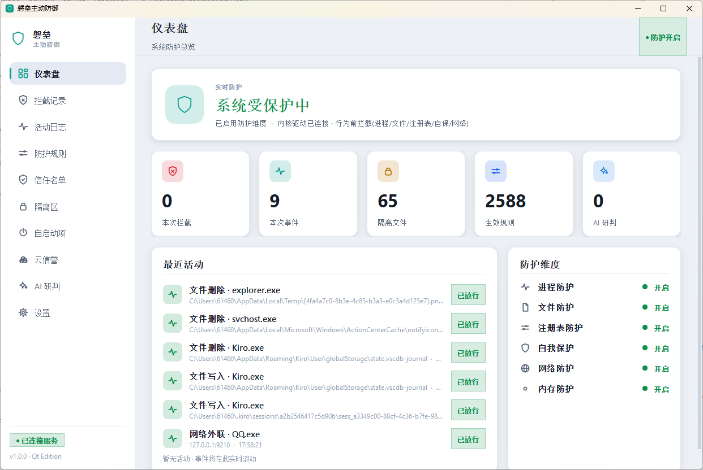
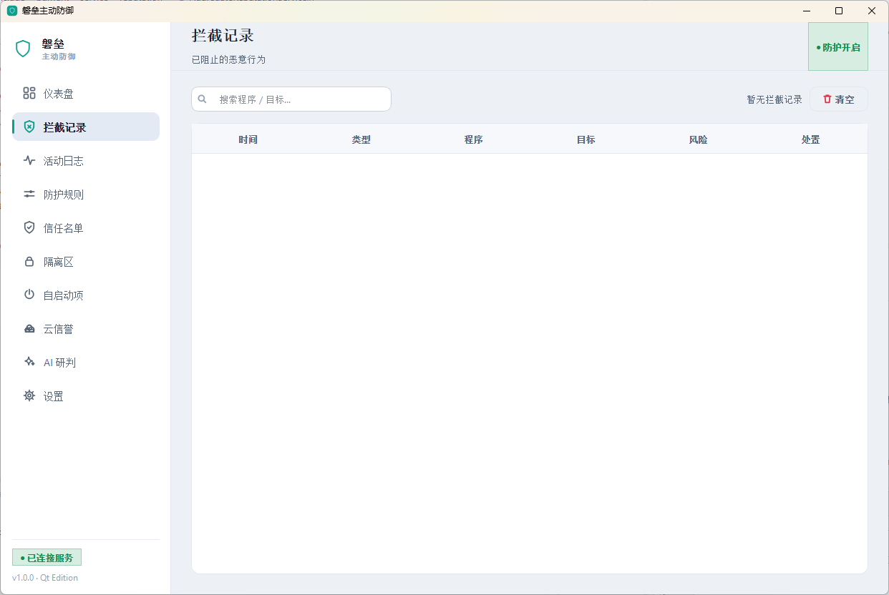
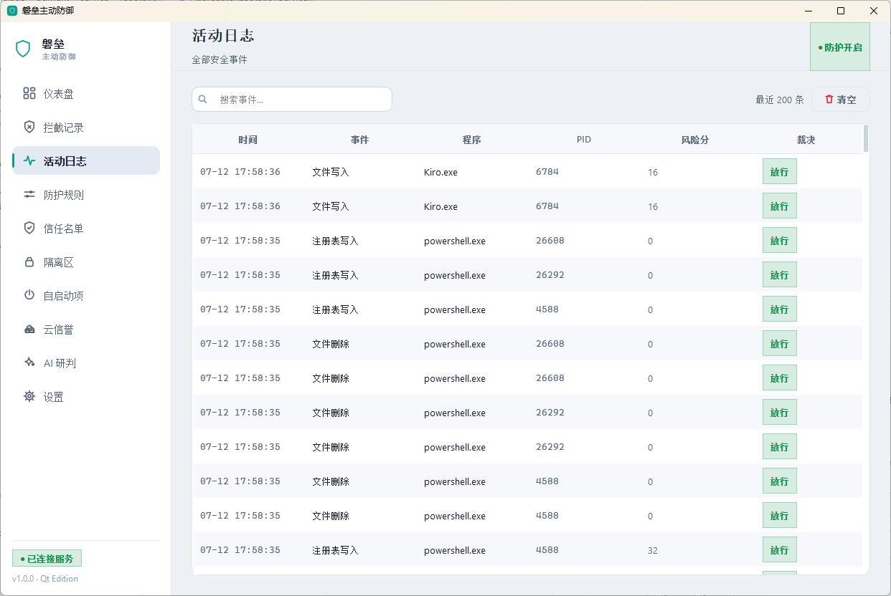
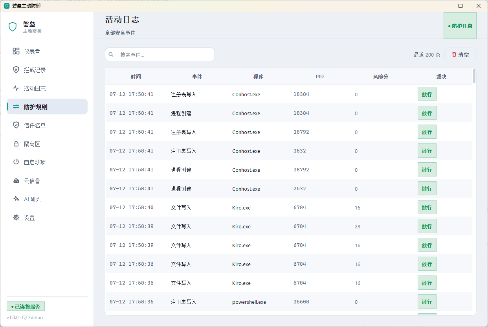
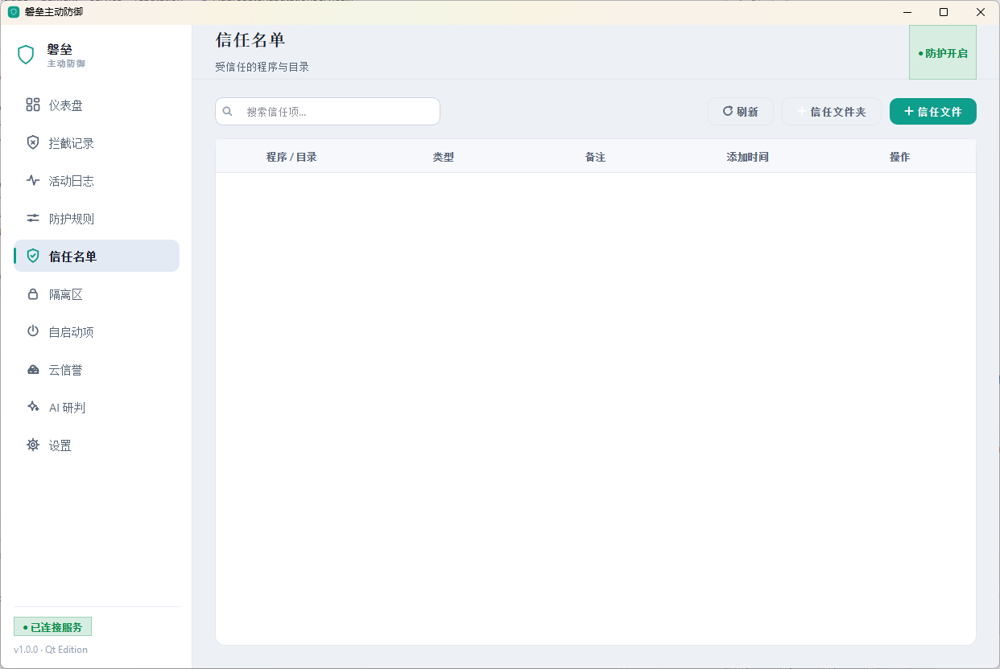
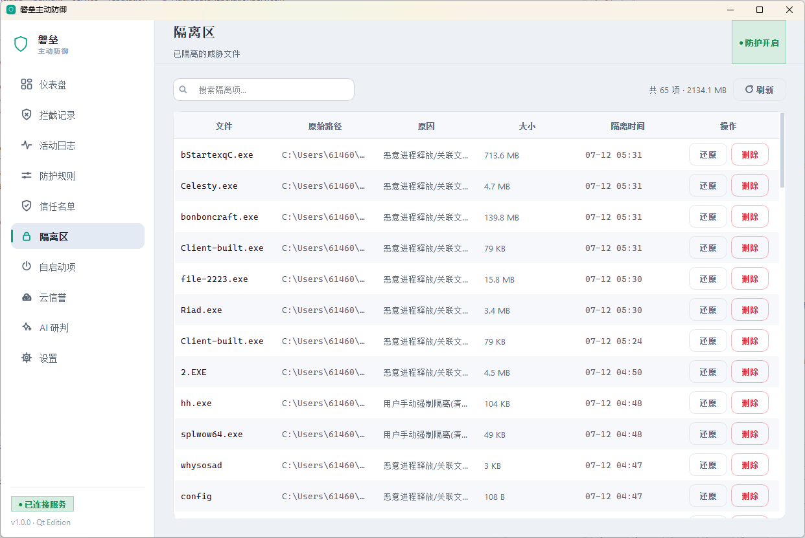
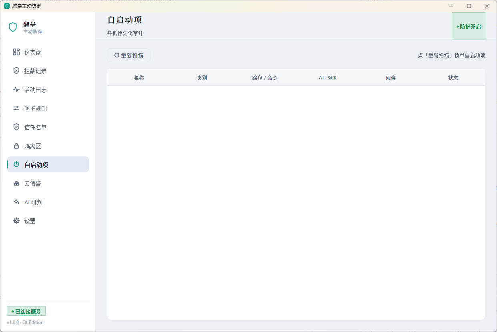
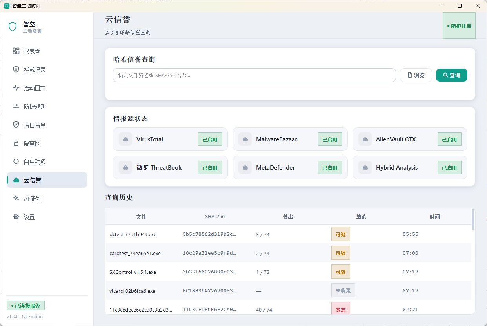
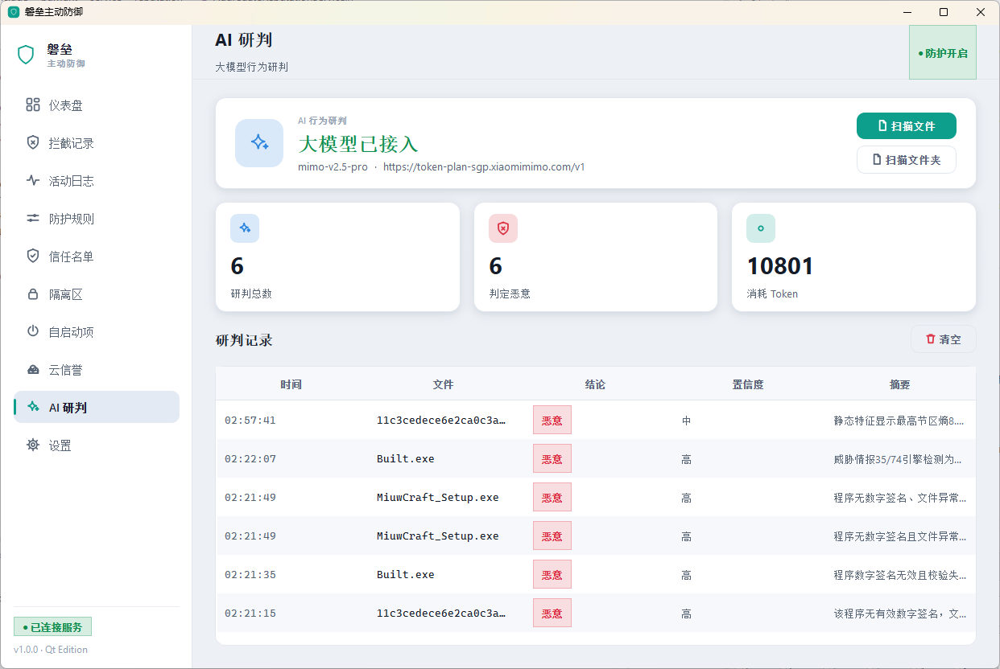
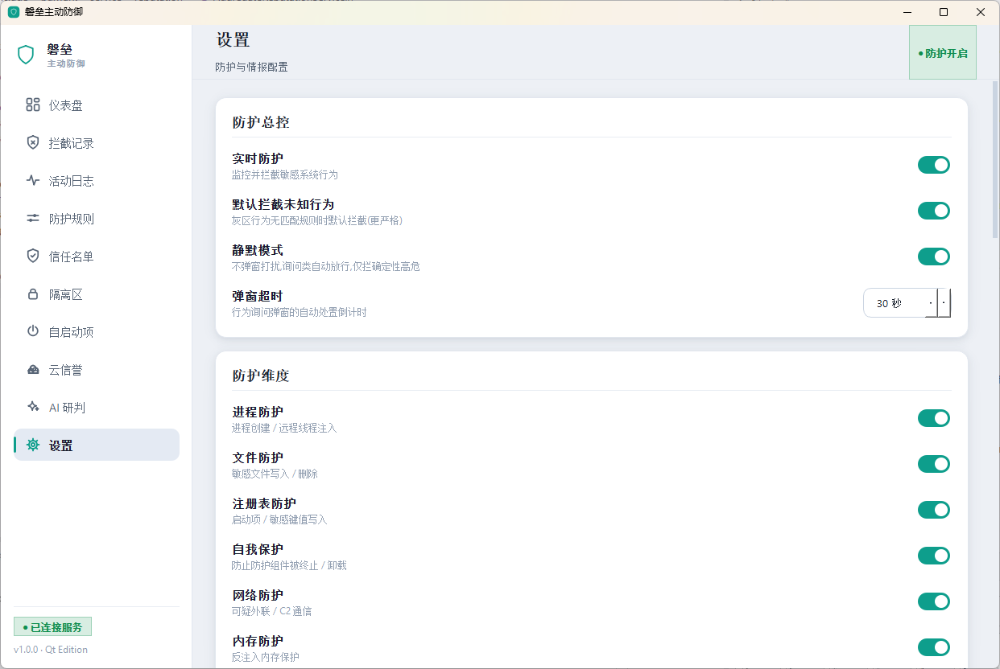

# 磐垒主动防御(Bulwark)

简体中文 | [English](README.en.md)

一个 Windows 主机入侵防御(HIPS)软件,与杀软 / EDR 同类。核心思路:**监控系统敏感行为 → 规则引擎决策 → 灰区行为弹窗让用户裁决(允许 / 阻止 / 记住)**,只对真正危险的行为动手,尽量不打扰。

磐垒采用三层协作架构:**内核态驱动(R0)** 做「行为发生前」拦截,**用户态 Windows 服务(R3)** 承载全部决策与处置逻辑,**Qt 桌面 UI** 负责状态展示、实时日志、行为弹窗、规则管理与 AI 研判。驱动 ↔ 服务经 Filter Manager 通信端口对话,服务 ↔ UI 经命名管道对话。无论事件来自哪个事件源,统一由一个 `RuleEngine` 作决策中心;其背后是一整套威胁启发式、多个专项分析器、有状态时序检测、多引擎哈希信誉、威胁情报 feed 与 AI 研判共同支撑。

> 本项目为 **C++ / Qt** 实现(由早期 .NET 原型移植而来)。
> - **用户态(R3 + UI)可直接编译运行**:服务 ↔ UI 命名管道链路、ETW 实时观测(进程 / 网络 / DNS / 注册表 / 文件)、用户态持续行为监控(自启动 + 勒索诱饵)、Authenticode 签名与证书画像校验、SHA-256、规则 / 信任 / 隔离管理、多引擎云信誉、AI 研判、SCM 服务安装。
> - **内核驱动(R0)可编译产出 `Bulwark.sys`**,用户态对接(连接 / 协议握手 / 事件收取 / 配置下发 / 裁决补偿)已完备,六个防护维度在代码层面均已实现。

> ⚠ **内核驱动尚未在真实内核里做过端到端验证。** `Bulwark.sys` 必须在**带快照的测试虚拟机**里开启测试签名并加载后,才能真正启用「行为发生前」内核拦截;内核回调出错可能蓝屏(BSOD)。默认发布产物跑的是 **ETW 用户态观测链路**。

## 两种事件源(可切换)

由 `appsettings.json` 的 `EventSource` 决定,无论选哪种,决策与 UI 完全一致:

- **`Driver`** —— 加载内核驱动 + ETW 观测。内核对硬拦名单 / 受保护项 / 网络黑名单 / 自我保护做「行为前」原地拦截;进程创建维度同时具备**内核本地事前拒绝**(命中「禁止执行」名单、或由已封禁的恶意主体派生 → `STATUS_ACCESS_DENIED`)与**遥测 + 启动后补偿结束**两条路径,未命中本地名单的灰区进程走后者。
- **`Wmi`** —— 仅 ETW 用户态观测(取值名沿用历史「Wmi」,实际是 ETW)。无法在动作前拦截,拦截由「事后结束作恶进程树」补偿。

> 无论哪种事件源,用户态都始终并行一个「持续行为源」(自启动持久化监视 + 勒索诱饵),弥补程序运行「之后」的事后盲区。

## 界面截图

| | |
|:---:|:---:|
| **仪表盘**<br> | **拦截记录**<br> |
| **活动日志**<br> | **防护规则**<br> |
| **信任名单**<br> | **隔离区**<br> |
| **自启动项**<br> | **云信誉**<br> |
| **AI 研判**<br> | **设置**<br> |

## 解决方案结构

```
cpp/                     C++ / Qt 实现(顶层 CMake:cpp/CMakeLists.txt,C++20)
├─ shared/            共享契约层(静态库,仅依赖 Qt6::Core;服务与 UI 共用)
│   ├─ src/models/       SecurityEvent / Verdict / DefenseRule(可到期·会话作用域)/ Evidence(证据链)等
│   ├─ src/engine/       决策与检测核心(见下「检测能力」),含 RuleEngine + 十余个分析器 / 监视器
│   └─ src/ipc/          IpcMessage(命名管道消息协议)
├─ service/           用户态服务(R3,生成 bulwark_service.exe):决策宿主 + 处置 + 命名管道服务端
│   ├─ src/main.cpp                装配全部组件 + SCM 集成(--install / --uninstall / --service / --inspect)
│   ├─ src/Worker.cpp              主防御循环:事件 → 富化 → 引擎 → 裁决 → IPC / 处置 / 清理 + 多个后台 worker
│   ├─ src/EtwProcessEventSource.cpp   krabsetw 实时观测(5 个 ETW 提供程序)
│   ├─ src/UserModeBehaviorSource.cpp  用户态持续行为监控(自启动 + 勒索诱饵)
│   ├─ src/DriverEventSource.cpp / DriverControl.cpp  内核源对接 + 按需加载 Bulwark.sys(minifilter)
│   ├─ src/EventSourceCoordinator.cpp  合并 ETW + 行为源 +(热切换的)内核源
│   ├─ src/monitoring/ProcessInspector.cpp  签名 / 证书画像 / 哈希 / 命令行 / 父进程取证
│   ├─ src/reputation/             VirusTotal / 微步 / MalwareBazaar / OTX / MetaDefender / HybridAnalysis + ThreatFox feed
│   ├─ src/QuarantineManager.cpp / ThreatRemediator.cpp  隔离区(可逆)+ 恶意足迹清理
│   ├─ src/PersistenceScanner.cpp  只读枚举 7 类自启动持久化点
│   └─ src/*Store.cpp              规则 / 设置 / 首见 / 基线 / 事件历史 / VT 历史 / 审计 / ECS 告警等持久化
└─ ui/                桌面 UI(生成 bulwark_ui.exe):Qt Widgets,经命名管道连服务
    ├─ src/MainWindow.cpp / pages/  10 个功能页
    ├─ src/dialogs/                 行为弹窗 / 角标通知 / 扫描进度 / 清理报告 / 攻击时间线
    └─ src/ai/                      UI 侧 AI 研判(静态特征提取 + 大模型)

Bulwark.Driver/         内核驱动(R0),与 cpp/ 平级,MSBuild + WDK 构建:Minifilter + 通信端口
├─ Driver.c ProcessMonitor.c FileMonitor.c RegistryMonitor.c SelfProtect.c
├─ NetMonitor.c ImageMonitor.c ThreadMonitor.c Comms.c
├─ HashScan.c           内核本地已知恶意 SHA-256 查杀(自带纯 C SHA-256,异步 worker,命中即结束进程)
├─ Policy.c             内核侧策略/名单容器
└─ Protocol.h           内核↔服务消息结构(用户态 DriverEventSource 直接复用此头,单一事实来源)

server/bulwark-broker/  可选的中央信誉服务端(broker.py,纯 Python 标准库 + SQLite),见「中央信誉服务」节
Bulwark.Sandbox/        Windows Sandbox(.wsb)配置与样本投放脚本,用于隔离环境里跑样本
ml/                     离线训练侧脚本(LightGBM,不参与 C++ 构建、当前产品不加载任何模型)
scripts/                build-driver.ps1(编译驱动)/ deploy-driver-vm.ps1(测试机签名加载)+ 若干本地部署脚本
```

> `ml/` 是历史遗留的离线实验目录:**当前代码里没有任何模型推理路径**,产品的检测能力全部来自规则 + 启发式 + 分析器 + 云信誉,不依赖机器学习模型。

## 决策流程(RuleEngine)

每个事件进入 `RuleEngine::evaluate` 后,按固定优先级顺序走一条流水线(而非简单的三选一),命中即返回:

1. **无条件放行**:本软件自身组件(按映像名 + 安装目录前缀识别)、用户明确信任的文件 / 文件夹(信任 = 完全跳过后续一切检测与后台扫描)。
2. **已安装的知名安全软件**:共存放行(`TrustPolicy::isTrustedSecurityProduct`)。
3. **已知良性厂商应用**(QQ / 微信 / 企业微信 / TIM):映像名在内置清单**且**持有健康的厂商签名时,**仅对网络外联与 DNS 事件**在时序检测前放行(`TrustPolicy::isTrustedVendorApp`),避免正常心跳保活被信标检测 / IP 情报误判为 C2 回连。**此档不覆盖其它维度**——同一进程的进程创建 / 模块加载 / 文件写 / 注册表写 / 注入事件照常走完整流水线,IM 侧载与群控 hook 模块加载仍会被检测。
4. **威胁研判**:`ThreatDetector::analyze` 计算风险分并置位「硬恶意指标」(见下)。
5. **有状态时序检测**:文件写 / 删 → 勒索行为监视器(触碰蜜罐诱饵直接 Block);网络外联 → C2 信标 + DGA 域名 + 外联速率;DNS 查询 → DGA 域名。
6. **行为基线偏离**(可开关):显著偏离程序自身历史画像时产出软信号,仅与硬指标互证才升格。
7. **显式规则**:按「层级(精确主体 > 硬覆盖 > 通配)> 具体度 > 动作强度 > 最近创建」排序命中;强可信 OS 组件 / 开发工具对「询问」类规则有豁免。
8. **强可信主体**直接放行(证书指纹白名单,或微软签名 + 系统目录,且签名健康、无危险行为)。
9. **签名异常**(证书被吊销 / 用过期证书签名)→ Block。
10. **健康签名**直接放行(排除硬指标与「空壳新证书」画像)。
11. **仅当存在硬恶意指标才处置**:风险分 ≥ 高危阈值 → Block,否则 → Ask(弹窗)。
12. **无硬指标 → 一律放行**(仅记录,软信号绝不单独定罪)。

> **注意信任通道的位置**:上面第 1~3 步的三条信任通道排在**显式规则匹配之前**,威胁研判也排在规则之前。也就是说「写一条 Block 规则」并不能压过这三条通道——被无条件放行 / 安全软件共存 / (网络维度的)厂商应用命中的事件,不会走到第 7 步。

裁决完成后自动追加「最终裁决」证据,并由 `AttackAnnotator` 统一标注 MITRE ATT&CK 技战术。裁决动作为 **Allow / Block / Ask**,来源标记为 命中规则 / 行为研判 / 可信放行 / 用户裁决 / 超时默认 / 默认策略。

## 检测能力(全部来自代码实现)

**威胁研判中心 `ThreatDetector`** 汇总内置启发式并调度多个专项分析器,每条命中都写入结构化证据(硬指标 / 软信号 / 互证 / 信任 / 规则 / 信息):

内置启发式:无可信签名、**签名校验失配 / 证书被吊销 / 过期证书签名**、首见 + 空壳新证书、**超大未签名文件(文件膨胀规避扫描)**、可疑目录运行(Temp / Public / ProgramData / Downloads / Roaming / Desktop 等)、**Windows 非标准子目录伪装**、**异常父子链**(Office / 浏览器派生 LOLBin,疑似宏病毒 / 钓鱼)、一张涵盖大量 ATT&CK 技战术的命令行特征表(`-enc` 编码命令、`DownloadString` / `Invoke-WebRequest` 内存下载、`IEX` 动态执行、`mimikatz` / `sekurlsa` / `comsvcs.dll` 凭据窃取、`vssadmin delete` 删卷影等)、**进程伪装**(系统进程名出现在合法目录之外,T1036.005)、**形近仿冒 / 同形字符伪装**(`svch0st` / `1sass` / 西里尔字母,编辑距离 ≤ 1)、**双重扩展名**(T1036.007)、**NTFS 备用数据流(ADS)执行**(T1564.004)、云信誉命中(见下)。

专项分析器:

- **LOLBins 白利用分析** —— 微软签名系统二进制(regsvr32 / rundll32 / mshta / certutil / bitsadmin / msbuild / wmic / comsvcs 等)被「二进制 + 特征参数」滥用(Squiblydoo、远程 HTA、certutil 下载、msbuild 内联任务、wmic 远程执行、comsvcs 转储 LSASS 等)。高置信滥用作硬指标,并**让签名信任豁免失效**——签名可信 ≠ 行为可信。
- **凭据访问 / LSASS 保护** —— LSASS 内存转储 / 注入、SAM/SECURITY 蜂巢导出、域控 NTDS.dit 提取、浏览器凭据库 / DPAPI 读取。
- **防御规避** —— 篡改 / 关闭 Defender、AMSI / ETW 致盲、清空事件日志、关防火墙 / UAC、结束安全软件进程。
- **远程控制 / RMM 滥用** —— RDP 劫持、反弹 shell、无人值守远控,及即时通讯(微信 / QQ)群控注入 / 侧载。
- **进程注入 / DLL 侧载** —— 跨进程远程线程(镂空 / APC / 劫持落点)、可写目录加载未签名模块(侧载)。
- **命令行混淆**(无特征码) —— 香农熵 / 符号占比 / 已知混淆构造 / 超长 Base64 块的统计与结构研判。
- **脚本内容静态分析** —— 对 PowerShell / VBS / JS / Batch 脚本体(如 `-EncodedCommand` 解码后)做危险命令 / 混淆 / 编码 / 网络特征检测。
- **杀伤链阶段分析** —— 把同一进程树上的事件归类到 ATT&CK 战术阶段,覆盖 ≥3 个不同阶段才计分,识别多阶段攻击。

有状态时序监视器(按 PID / 序列维护滑动窗口,线程安全):

- **勒索行为监视器** —— 批量改写速率、扩展名同化、勒索信写入、**蜜罐诱饵触碰**(命中即直接 Block)。
- **C2 信标检测** —— 按 (PID | 远端) 记录外联时序,分析周期性 / 抖动(变异系数)识别回连信标。
- **外联速率 / 扇出监视** —— 速率突发与目标扇出(软信号,需互证)。
- **DGA 随机域名分析** —— 仅看域名字符串统计特征(熵 / 元音比 / 连续辅音 / 数字交错),无黑名单。
- **行为基线 / 异常检测** —— 为每个程序建立子进程 / 外联 / 写目录正常画像,带学习期,显著偏离产出软信号,可导出 / 导入快照。
- **进程链关联跟踪** —— 把孤立事件按进程树串起来,提供溯源上下文、识别 dropper(近期被写入的可执行体)、支持整树足迹清理。

**信任策略 `TrustPolicy`** 分级:知名安全软件共存、强可信(可跳过行为检测)、健康签名、较可信签名(仅风险打折)、可豁免敏感规则的 OS 组件。任一档下出现危险命令行 / LOLBin 滥用 / 凭据攻击 / 签名异常,一律不再放行。

**设计原则**:软信号(未签名、可疑路径、首见、新证书)**永远不单独触发拦截或弹窗**,只加分并需与硬指标互证升格;健康签名的正规程序默认放行不打扰。

## 云信誉、威胁情报与 AI 研判

- **多引擎哈希信誉** —— 经 `curl.exe` 传输、分级缓存(`%ProgramData%\Bulwark\reputation.jsonl`:恶意永久 / 干净 7 天 / 可疑 24 时 / 未知短负缓存,断网时用「最近已知」兜底富化)、限流。聚合 6 个源并取最强结论(恶意 > 可疑 > 干净 > 未知):**VirusTotal(旗舰,支持整文件上传扫描 + 每引擎详情)、微步 ThreatBook(另含 IP 信誉)、MalwareBazaar、OTX、MetaDefender、HybridAnalysis(另含沙箱行为画像)**。每个源都可单独启停;信誉只加 / 减分,绝不单独处置,断网不影响实时防护。
- **中央信誉服务(哈希查询默认先走服务器,可关)** —— 见下方独立小节「中央信誉服务」。**这是唯一一项在你没填任何 API Key 时也会产生外发请求的功能**,请先读那一节再决定是否保留默认开启。

> **代码默认 vs 随包配置**:各情报源在**代码里**的默认值是「关」(`BulwarkOptions.h` 各 `Enabled = false`),但仓库里随服务发的 `cpp/service/appsettings.json` 出于开箱即用把 VirusTotal / MalwareBazaar / OTX / 微步 / MetaDefender / HybridAnalysis / ThreatFox feed / 中央信誉服务**全部置为 `true`**。配置文件覆盖代码默认,所以你直接跑打包产物拿到的是「全开」状态。要真正跑纯本地,请把对应 `Enabled` 改成 `false`,或在 UI 设置页逐项关掉。

> 开源版**不内置任何厂商密钥**——源码与 `cpp/service/appsettings.json` 模板里各 Key 字段一律为空(VirusTotal 的内置 Key 仅支持构建时经 `-DBULWARK_VT_BUILTIN_KEY` 注入,默认不注入)。⚠ 但 `cpp/dist/` 下那份**本地打包产物**不受此约束:它是开发机的运行目录(已被 `.gitignore` 排除、不在版本库里),其 `appsettings.json` 可能残留开发者自己的真实 Key。**不要把 `cpp/dist/` 整目录分发给别人**;要分发就用空 Key 的模板重新生成配置。
- **威胁情报 feed(ThreatFox / abuse.ch)** —— 定期拉取近期恶意 IOC(按可信度阈值),**自动生成哈希 / IP / 域名拦截规则**(带来源标记与到期时间),也支持在 UI 里手动「立即刷新 / 预览 / 采纳」。
- **网络外联 IP 情报互证** —— 仅对可疑外联,后台限流查微步 IP 信誉(月配额极低 + 7 天强缓存 + 在途去重),确认恶意再补偿处置(结束外联进程树)。
- **双击 / 释放载荷病毒扫描** —— 双击启动、dropper 派生、近期落盘的可执行体,以及双击的 MSI/MSP 安装包,后台先按哈希查 VT、未收录则上传整文件云端扫描,进度实时推 UI 卡片、结果落 VT 历史去重,确认恶意即补偿处置。
- **AI 研判(UI 侧,大模型)** —— OpenAI 兼容接口,异步、任何失败都 fail-open。三种能力:①基于**纯静态内容特征**研判文件恶意性(**绝不执行样本**);②把自然语言安全意图转成 1~5 条可复核的防御规则;③在「云信誉」详情窗口对恶意 / 可疑文件**一键 AI 清理**(把行为画像交给大模型生成清理脚本,详见下节「处置、隔离与足迹清理」)。静态特征由 `StaticFeatureExtractor` 越界安全地提取:PE 头 + 各节香农熵(判壳,熵 > 7.2)、ASCII/UTF-16 字符串里的危险 Win32 API / URL / IP、能力标签(进程注入 / 反调试 / 键盘钩子 / 加密勒索 / 网络下载 / 持久化 / 提权 / 进程发现 / 命令执行)、脚本片段。AI 研判历史落盘于 `%ProgramData%\Bulwark\ai_scan_history.json`。
- **AI 灰区研判策略** —— 仅对「询问(Ask)」类灰区事件咨询大模型:AI 判恶意 → 升格 Block;AI 判干净且无硬指标 → 降级 Allow(减打扰);其余维持原判。**AI 绝不压制硬指标、也绝不改判确定性拦截或强可信放行。**

## 中央信誉服务(ReputationProxy)

⚠ **这一项默认开启,并且会把本机文件的 SHA-256 发到一台第三方服务器。** 请先读完本节再决定保留还是关闭。

**它是什么** —— 一个「哈希信誉代理」。开启后,哈希查询**优先**走该服务器而不是本机直连各情报源:服务端持有上游 API Key、并为所有接入端点维护一份共享缓存(别的机器查过的哈希,你这里零往返直接命中)。实现是 `ProxyReputationService`,一个套在 `AggregateReputationService` 外面的 proxy-first 装饰器,挂在 `ReputationManager` 这个唯一收口点上——因此**后台信誉队列、内存防护 VT 复核、UI 手动查询走的都是它**。服务端代码在本仓 `server/bulwark-broker/`(`broker.py`,纯 Python 标准库 + SQLite)。

**外发的是什么** —— 只有 **SHA-256 摘要**(以及可选的 Bearer 令牌);**不上传文件内容**。整文件上传扫描仍是本机直连 VirusTotal 的独立功能,不经此代理。

**默认值** —— `cpp/service/appsettings.json` 与 `cpp/dist/appsettings.json` 里均为:

```jsonc
"ReputationProxy": {
  "Enabled": true,                              // ← 默认开
  "BaseUrl": "https://vt.bulwark.icu",          // ← 项目维护者运营的实例
  "BearerToken": "",                            // 可用 BULWARK_REPPROXY_TOKEN 覆盖
  "QueryTimeoutSeconds": 8
}
```

**怎么关** —— 把 `Enabled` 改成 `false`。关掉后哈希查询完全回退本机直连聚合器,**保护能力不下降**(只是失去共享缓存与服务端 Key)。

**失败行为** —— 任何失败(代理禁用 / 网络 / HTTP / 解析错误 / 服务端给不出权威结论)都**透明回退**本机直连聚合器。离线时客户端熔断跳过这一跳,每 60s 半开重试一次,不会为每次查询白等一个超时。服务端当前只聚合 VirusTotal + 微步,其余四源仍由本机直连兜底。

**想自建** —— `server/bulwark-broker/broker.py` 可直接部署,把 `BaseUrl` 指向自己的实例即可;这样哈希不出自己的基础设施。

## 情报源与 AI 密钥申请(全部可选,不填也能用)

云信誉、威胁情报 feed、AI 研判都是**锦上添花**:不填任何 Key 也能正常跑本地启发式 + 行为检测。想开哪个,就去 UI **设置**页填对应 API Key 再打开开关即可;绝大多数源都有**免费额度**。

> ⚠ **默认并非「全部关闭」**:随包的 `appsettings.json` 把各情报源与**中央信誉服务**都置为 `Enabled: true`(见上文「代码默认 vs 随包配置」)。没填 Key 的源查询会失败并静默回退,不影响防护;但**中央信誉服务不需要你的 Key 就会工作**,即哈希会外发。真要完全离线,请显式把各 `Enabled` 改为 `false`。

> 🔐 **关于密钥安全**:你填的 Key 只保存在本机 `%ProgramData%\Bulwark\settings.json`(或环境变量),**绝不写入源码、绝不上传、绝不进版本库**——`cpp/service/appsettings.json` 模板里各 Key 字段一律为空。(`cpp/dist/` 是被 `.gitignore` 排除的本地运行目录,可能含开发者自己的 Key,不要整目录分发。)

| 情报 / AI 源 | 用途 | 申请地址 | 备注 |
|----|------|----------|------|
| **VirusTotal** | 哈希信誉旗舰(70+ 引擎)+ 整文件上传扫描 | https://www.virustotal.com/ | 注册后在 头像 → API Key 获取;免费公开额度 |
| **微步 ThreatBook** | 哈希信誉 + 网络 IP 信誉 | https://x.threatbook.com/ | 社区版注册后在个人中心获取;IP 信誉月配额较低 |
| **MalwareBazaar / ThreatFox**(abuse.ch) | 恶意样本哈希查询 + 情报 feed 自动生成规则 | https://auth.abuse.ch/ | 免费注册一个 Auth-Key,两者共用 |
| **AlienVault OTX** | 社区威胁情报(pulse) | https://otx.alienvault.com/ | 注册后在 Settings → API 获取;免费 |
| **MetaDefender Cloud**(OPSWAT) | 多引擎哈希信誉 | https://metadefender.opswat.com/ | 注册后在账户页获取;有免费额度 |
| **Hybrid Analysis** | 沙箱信誉 + 行为画像 | https://www.hybrid-analysis.com/ | 注册后在 Profile → API key 获取;免费 |
| **小米 MiMo 大模型** | AI 行为研判 + 自然语言生成规则 | https://mimo.mi.com/ | 用小米账号登录,在 控制台 → API Keys 申请;基址 / 模型见 `appsettings.json` 的 `Ai` 节 |

> 填 Key 的三种方式(优先级:环境变量 > 配置文件):① **UI 设置页**逐项填写(最方便,即时生效);② **环境变量**(`BULWARK_VT_APIKEY` / `BULWARK_THREATBOOK_APIKEY` / `BULWARK_MDC_APIKEY` / `BULWARK_OTX_APIKEY` / `BULWARK_HA_APIKEY` / `BULWARK_MB_AUTHKEY`(abuse.ch)/ `BULWARK_AI_APIKEY`);③ 本机 `appsettings.json` 对应字段——**注意别把带真实 Key 的配置提交上库**。
>
> 🔑 **VirusTotal 多 Key / 提额**:VT 支持一次配多个 Key,用英文逗号分隔(如 `key1,key2,key3`)。**每个 Key 独立计账,额度真正叠加**;某个 Key 触发限流(429)或失效(401)会自动冷却、跳到下一个。每个 Key 还可选按 `KEY:每日上限:每分钟上限` 标注额度,便于混用免费与 Premium,例如 `免费key,你的PremiumKey:100000:1000`(不标注则用免费档默认 500/天、4/分)。若在服务(SYSTEM)身份下运行,环境变量需设为**系统级**,否则读不到用户级变量。
>
> ⚠️ VT 服务条款禁止「注册多个免费账号绕过限额」,公开 API 也不得用于商业产品。多 Key 主要面向 **Premium / 企业 Key** 或你合法拥有的独立 Key;要长期高频 / 全量使用,请走 VT Premium API。

## 处置、隔离与足迹清理

- **拦截**:内核源在动作前原地拒绝(硬拦 / 受保护项 / 网络黑名单 / 自保);用户态观测源无法事前拦截,由 `Worker` 事后**结束作恶进程树**补偿(带关键进程防护)。
- **隔离区**:确认恶意的载荷经 XOR 中和拷贝进金库(`%ProgramData%\Bulwark\quarantine\`),删除原文件(被占用则计划重启删除),**完全可逆还原**。
- **足迹清理 `ThreatRemediator`**:对确认恶意的进程树,隔离其在用户可写落地区释放的关联文件,并移除指向恶意文件的注册表 Run / IFEO / 服务持久化(必要时夺取所有权强删);支持按持久化条目分类清理(Run 值 / IFEO / Winlogon / AppInit_DLLs / 启动文件夹 / 计划任务 / 服务)。清理结果以报告呈现,未能处理的残留可在 UI 一键重试。
- **AI 清理(手动,UI 侧)** —— 面向「云信誉」页里已判**恶意 / 可疑**的文件,由大模型生成清理方案并执行。**使用方法**:
  1. 先在 **设置 → AI** 填好接口地址与 API Key(未配置时按钮会提示去设置,不会报错);
  2. 到「**云信誉**」页**双击**一条恶意 / 可疑记录,打开行为关系图详情窗口;
  3. 点右下角 **🤖 AI 清理**——软件把该文件的行为画像(释放文件 / 外联 IP·域名 / 注册表 IOC + 结论)发给大模型,生成一份 **PowerShell 清理脚本**;
  4. 脚本在弹窗内**完整可见、可复核**,确认无误后点「**执行清理**」:需二次确认并触发 **UAC 提权**(清理要动 HKLM / 防火墙 / hosts),在可见的 PowerShell 窗口按「终止进程 → 删文件 → 清注册表 → 防火墙 / hosts 阻断」顺序执行;也可「**复制脚本**」自行手动跑。

  清理逻辑复用 UI 侧 `AiScanner`(与「设置」里的大模型配置同步),任何失败 fail-open,**脚本对用户完全可见、绝不无声删除**。
- **情报行为规则**:确认恶意后,据信誉源提供的行为画像 IOC(释放文件 / 注册表 / 外联 IP / 域名)累加去重生成主动拦截规则并落盘。
- **ECS 结构化告警导出**(可开关):把已处置事件格式化为 Elastic Common Schema 风格 JSON-lines(`event.* / process.code_signature.* / threat.technique[]` 等,并在 `bulwark.*` 下保留证据链),写入 `%ProgramData%\Bulwark\alerts\`,可接入 SIEM。

## 可解释性

每个事件都携带结构化 **证据链**:逐条记录「来源分析器 / 类别(硬指标·软信号·互证升格·信任·规则·裁决)/ 风险分贡献 / 说明」,末尾以「最终裁决」收尾。行为弹窗以彩色时间线呈现「为什么这么判」,而非一个孤立分数;同一结构化数据也作为 AI 研判输入。**规则可设到期时间与「仅本次会话」作用域**——弹窗「记住选择」可选永久 / 会话 / 1 小时 / 1 天,会话规则不落盘、限时规则到期自动清理,降低一时之选造成永久误放行。

## 配置(appsettings.json 的 Bulwark 节)

配置文件须与 `bulwark_service.exe` 同目录;缺失的键回退默认值。各情报源密钥可用环境变量覆盖(`BULWARK_VT_APIKEY` / `BULWARK_THREATBOOK_APIKEY` 等,环境变量优先于配置字段)。

```jsonc
{
  "Bulwark": {
    "EventSource": "Driver",       // Driver=内核+ETW / Wmi=仅 ETW 观测
    "KernelDriverEnabled": true,   // 启用内核驱动(EventSource=Driver 时等效开启)
    "TrustSignedActors": true,     // 自动放行强可信签名程序
    "DefaultAction": "Allow",      // 灰区无规则时的默认动作,也是弹窗超时后的动作(Allow / Block)
    "PromptTimeoutSeconds": 30,    // 弹窗超时秒数;超时即按上面的 DefaultAction 处置
    "ExportEcsAlerts": false,      // ECS JSON-lines 告警导出(接 SIEM)
    "OnlineCertRevocationCheck": false,  // 证书吊销联网校验(默认仅用本机缓存 CRL,不阻塞富化)

    "ProtectedPaths": [            // 受保护路径(子串):删除/重命名拦截(内核) / ETW 观测集
      "\\Start Menu\\Programs\\Startup\\", "\\System32\\drivers\\etc\\hosts", "\\Tasks\\"
    ],
    "FileHardBlocks": [],          // 内核硬拦文件(精确子串):拒绝一切写/删/改名/覆盖打开,只读放行
    "ProtectedRegistryKeys": [     // 受保护注册表键(子串):Run/RunOnce/IFEO/Winlogon/Services 等
      "\\CurrentVersion\\Run", "\\Winlogon", "\\Services\\"
    ],
    "RegistryHardBlocks": [],      // 内核硬拦注册表(精确!):命中即内核本地 STATUS_ACCESS_DENIED
    "MemoryProtectionTargets": [ "lsass.exe" ],   // 反注入保护目标(内核剥离写内存/远程线程权限)
    "BlockedRemoteEndpoints": [],  // 网络黑名单 "ip" 或 "ip:port"(仅 Driver 模式)

    "Etw": { "Enabled": true, "DnsClient": true, "KernelNetwork": true,
             "KernelRegistry": true, "KernelFile": true,
             "NetworkUntrustedOnly": true, "SuspiciousOnly": true },

    "VirusTotal": { "Enabled": true }, "MalwareBazaar": { "Enabled": true },
    "Otx": { "Enabled": true }, "ThreatBook": { "Enabled": true },
    "MetaDefender": { "Enabled": true }, "HybridAnalysis": { "Enabled": true },
    "ThreatFoxFeed": { "Enabled": true },

    // 中央信誉服务:默认开启,会把本机文件 SHA-256 发到该地址。详见「中央信誉服务」节。
    "ReputationProxy": { "Enabled": true, "BaseUrl": "https://vt.bulwark.icu",
                         "BearerToken": "", "QueryTimeoutSeconds": 8 },

    "Ai": { "BaseUrl": "https://token-plan-sgp.xiaomimimo.com/v1", "ApiKey": "", "Model": "mimo-v2.5-pro" }
  }
}
```

> 完整默认配置见 `cpp/service/appsettings.json`。上面只是节选,以下键**代码支持但样例里省略了**:每个情报源各自的限流(`RequestsPerMinute` / `RequestsPerDay`)、超时与恶意判定阈值;`VirusTotal.PriorityDailyReserve`(为优先复核预留的每日配额);`Etw` 节完整有 14 个键(除样例里的开关外,还有 `PerProcessNetPerMinute` / `PerProcessRegPerMinute` / `PerProcessFilePerMinute` / `PerProcessDnsPerMinute` 每进程每分钟上报上限、`DedupWindowSeconds` 去重窗口、`RawChannelCapacity` 原始事件中继容量、`SessionName`);`ProxyUrl`(全局代理)、`TrustedDirectories`(整目录信任)、`EnforceUiClientSignature` 与 `UiClientAllowedThumbprints` / `UiClientAllowedPublishers`(仅放行指定签名的 UI 连管道,IPC 自保)。
>
> ⚠ **各情报源与中央信誉服务在随包配置里是打开的**(代码默认为关,配置文件覆盖之),API Key 可在 UI 热更或用环境变量覆盖。要跑纯本地请显式改 `Enabled: false`。

## 小白上手指南(从零到跑起来)

零基础也能编译体验。全程需要**管理员权限**(实时监控是系统级能力)。

**第 1 步 · 装两样东西**
1. **Visual Studio 2022**(社区版免费):安装时勾选「**使用 C++ 的桌面开发**」工作负载。
2. **Qt 6.8**(开源版免费):在 Qt 在线安装器里选 **MSVC 2022 64-bit** 组件,默认装到 `C:\Qt\6.8.3\msvc2022_64`。

> 只尝鲜可跳过 WDK;想体验内核驱动才需要额外装 **Windows Driver Kit(WDK)**。

**第 2 步 · 拿代码**
```powershell
git clone https://github.com/z614606517zz/-Bulwark.git
cd -Bulwark
```

**第 3 步 · 最省事:双击一键脚本**
在仓库根目录双击 **`一键启动-仅用户态.bat`**。它会自动请求管理员权限,然后:编译 → 打包到 `cpp\dist` → 安装并启动 `BulwarkService` → 打开界面。**不加载内核驱动、不改测试签名、没有蓝屏风险**,最适合第一次尝鲜。
（若脚本里的 Qt 路径和你的不一致,编辑 `cpp\scripts\dev-all.ps1` 改成你的 Qt 路径。）

**第 3 步(备选)· 手动编译**
```powershell
cmake -G "Visual Studio 17 2022" -A x64 -S cpp -B cpp\build -DCMAKE_PREFIX_PATH="C:/Qt/6.8.3/msvc2022_64"
cmake --build cpp\build --config Release
```
产物在 `cpp\build\service\Release\bulwark_service.exe` 与 `cpp\build\ui\Release\bulwark_ui.exe`。**以管理员**先跑服务、再跑 UI(`appsettings.json` 要和服务 exe 同目录)。

**第 4 步 · 开始用**
- 界面左下角状态点变**绿**(“已连接服务”)= 一切就绪。
- 平时静默运行;遇到可疑灰区行为会**弹窗**让你选「允许 / 拦截」,可勾「记住」生成规则。
- 关掉主窗口会**最小化到托盘**继续防护;右键托盘图标可退出。

**第 5 步(可选)· 开云查毒 / AI**:去**设置**页填对应 API Key 并打开开关(申请地址见上节「情报源与 AI 密钥申请」)。不填也能用,只是少了云端信誉和 AI 研判。

**第 6 步(可选 · 进阶)· 体验内核「行为前」拦截**:⚠ 会开启测试签名并加载内核驱动,**回调出错可能蓝屏**。**务必在带快照的测试虚拟机里**双击 `一键启动.bat`,切勿在日常电脑上直接跑。

**常见问题**
- **UI 一直「未连接服务」**:多半没以管理员运行,或服务没起来。用管理员重跑,或 `sc start BulwarkService`。
- **CMake 找不到 Qt**:确认 `-DCMAKE_PREFIX_PATH` 指向你真实的 `Qt\...\msvc2022_64` 目录。
- **没有任何事件**:实时监控(ETW)需要管理员权限。

## 快速开始(一键启动)

仓库根目录提供一键脚本,自动请求管理员权限,依次:编译 → 部署到 `cpp\dist` → 安装并启动 `BulwarkService` → 打开 UI。

- **`一键启动-仅用户态.bat`** —— 推荐首次使用。只跑用户态 ETW 观测链路,**不加载内核驱动、不改测试签名、无蓝屏风险**。
- **`一键启动.bat`** —— 完整链路,额外编译并加载内核驱动 `Bulwark.sys`(会开启测试签名并需重启一次)。⚠ **内核回调出错可能蓝屏,请务必在带快照的测试虚拟机中运行。**

其余脚本:`启用驱动.bat`(单独加载内核驱动)、`诊断驱动.bat`(驱动加载诊断,写入 `driver_diag.txt`)。

> 需预装 **Visual Studio 2022(含 C++ 工具链)** 与 **Qt 6.8**;脚本默认 Qt 路径 `C:\Qt\6.8.3\msvc2022_64`,可编辑 `cpp\scripts\dev-all.ps1` 调整。

## 构建与运行(开发调试)

ETW 实时观测与内核驱动都需**管理员权限**。

```powershell
# 1) 配置 + 构建(顶层 CMake 一并构建 shared / service / ui)
cmake -G "Visual Studio 17 2022" -A x64 -S cpp -B cpp\build -DCMAKE_PREFIX_PATH="C:/Qt/6.8.3/msvc2022_64"
cmake --build cpp\build --config Release

# 2) 以管理员分别运行服务与 UI(appsettings.json 需与 bulwark_service.exe 同目录)
.\cpp\build\service\Release\bulwark_service.exe   # 终端 1:服务(控制台调试模式)
.\cpp\build\ui\Release\bulwark_ui.exe             # 终端 2:UI(manifest 已声明 requireAdministrator)
```

UI 顶部状态点变绿表示已连接服务。真实进程启动时:带强可信签名的自动放行并记入日志;灰区且有硬指标的弹窗让你选允许 / 阻止,可勾选「记住」并选作用域生成规则。规则持久化在 `%ProgramData%\Bulwark\rules.json`。

> `cpp\dist\` 下已有一份打包产物(两个 exe + Qt 运行库),可直接以管理员运行。诊断工具:`bulwark_service.exe --inspect <文件路径>` 只读打印某文件的签名 / 证书画像 / 哈希取证,不启动任何监控。

## 界面功能(10 个页面)

侧栏 10 个页面(顺序如下),顶部状态点变绿表示已连接服务,侧栏底部标注 `v1.0.0 · Qt Edition`。关闭主窗口最小化到系统托盘,后台持续防护(托盘菜单:显示主界面 / 立即扫描 / 退出)。

1. **仪表盘** —— 防护 / 未连接状态横幅、内核连接状态、AI Credits 月度用量、ALLOWED / BLOCKED / AI SCANS / TOTAL 四张统计卡、实时滚动的 LIVE LOG。
2. **拦截记录** —— 被「直接拦截」的确定性高危行为;双击任意条目打开「攻击时间线」回溯攻击链。
3. **活动日志** —— 更全的事件流(放行 / 询问 / 拦截,带风险分与裁决文案),落盘保留、重启回填;双击看攻击时间线。
4. **防护规则** —— 查看 / 管理规则。**+ 新增规则**(主体自动识别精确路径 / 通配 / 裸文件名)、**🤖 AI 生成**(自然语言 → 1~5 条建议规则逐条采纳)、刷新 / 删除;弹窗勾「记住」也会自动生成规则。
5. **信任名单** —— 受信任程序 / 目录,名单内目标直接放行不再检测。**+ 添加信任**(选可执行文件**或整个目录**)、移除、刷新。
6. **隔离区** —— 已隔离的威胁文件。列:文件 / 原因 / 时间;可**还原**(恢复原位)、**删除**(永久)。
7. **自启动项** —— 点扫描只读枚举 7 类自启动持久化点(注册表 Run/RunOnce、启动文件夹、Windows 服务、计划任务、映像劫持 IFEO、Winlogon、AppInit_DLLs),逐项启发式打分 + ATT&CK 标注、按风险等级着色。**只读,绝不修改任何自启动项**。
8. **云信誉** —— 多引擎哈希信誉查询中心:各源启用 / 连接状态与测试、按文件 / 哈希手动查询、VirusTotal 查询历史;命中恶意 / 可疑自动弹出行为关系图详情窗口,该窗口对恶意 / 可疑文件提供 **🤖 AI 清理**——一键把行为画像交给大模型生成 PowerShell 清理方案并可提权执行(见「处置、隔离与足迹清理」)。
9. **AI 研判** —— 大模型基于静态特征研判文件(不执行样本)。扫描溯源 / 扫描文件 / 扫描文件夹 / 停止;统计 SCANNED / CLEAN / SUSPICIOUS / MALICIOUS,结果含路径 + SHA256、判定、置信度、摘要,可逐条溯源。
10. **设置** —— 详见下。

**弹窗与通知**:
- **行为裁决弹窗**:无规则命中且主体不可信时弹出。展示主体 + 签名 / 发布者、命令行、目标、SHA256、风险因子、证据链要点、ATT&CK 标签;底部「记住选择」+ 作用域(永久 / 会话 / 1 小时 / 1 天)+ 允许 / 拦截;带按 `PromptTimeoutSeconds` 的超时自动裁决;可打开「攻击时间线」。
- **角标通知**:确定性高危被直接拦截、或触发 AI 研判时的堆叠角标提示。
- **扫描进度卡**:双击 / 释放载荷查毒的实时进度与结论,AI 研判结果也在此收尾。
- **清理报告**:恶意足迹清理后弹出(已隔离 / 已移除持久化 / 未能清理项可一键重试)。

### 设置页(全部为真实开关)

- **防护总控**:实时防护(总开关)、默认拦截未知行为(灰区无规则时更严格)、静默模式(询问类自动放行,仅拦确定性高危)。
- **防护维度**:进程 / 文件 / 注册表 / 自我保护 / 网络,逐项开关;内存防护(反注入)及其 VT 复核。
- **决策策略**:自动信任签名程序、拦截即隔离。
- **内核驱动**:启用开关 + 连接状态 / 内核状态 / 当前事件源。
- **威胁情报**:VirusTotal / 微步 / MalwareBazaar / OTX / MetaDefender / HybridAnalysis 逐源开关 + API Key + 测试连接 + 微步网络 IP 情报开关。
- **AI / 大模型**:双击启动即研判、研判期间挂起进程、研判失败即拦截(严格)、灰区 AI 研判、Credits 预算护栏 + 月度额度、API 基址 / Key / 模型 + 测试。
- **持续行为防护**:用户态持续行为监控、勒索蜜罐诱饵、行为基线异常检测。
- **扫描内容上限**:脚本源码上限(KB)、二进制采样上限(MB)、字符串提取条数。

## 作为 Windows 服务安装(管理员)

服务自带 SCM 注册(用户态服务名 `BulwarkService`,与内核驱动服务 `Bulwark` 区分):

```powershell
.\bulwark_service.exe --install     # 注册为自动启动服务
sc start BulwarkService             # 启动
.\bulwark_service.exe --uninstall   # 停止并卸载
```

## 内核驱动(R0):行为发生前拦截

`Bulwark.Driver` 全部使用微软**文档化 API**、不做 SSDT Hook,**PatchGuard 友好**,以 `/INTEGRITYCHECK` 链接。它注册一个 **Minifilter**,既挂接 I/O 回调,又借用 Filter Manager 的**通信端口**(`FltCreateCommunicationPort` / `FltSendMessage`)与用户态服务对话;连接时先做**协议握手**(校验版本号 + 各结构体大小),不一致则用户态一律降级、绝不拦截(防结构错位误判)。

| 维度 | 内核机制 | 处置 |
|------|----------|------|
| **进程(M2)** | `PsSetCreateProcessNotifyRoutineEx` + `HashScan.c` | 三条路径:①**事前拒绝**——新进程映像命中「禁止执行」名单、或创建者本身在封禁集里 → 回调内直接置 `CreationStatus = STATUS_ACCESS_DENIED`,样本根本起不来(零用户态往返、无竞态,重启后名单重推仍拦);②**内核本地哈希查杀**——已知恶意 SHA-256 集非空时把 PID 入队,独立系统线程在 PASSIVE_LEVEL 算哈希,命中即 `ZwTerminateProcess`;③**遥测 + 补偿**——其余进程不挂起,上报后由用户态裁决并结束进程树。内核对系统目录 / 关键进程走白名单零延迟放行,且关键系统进程**绝不**进入事前拒绝(防 `CRITICAL_PROCESS_DIED`) |
| **文件(M3)** | Minifilter 预操作 `IRP_MJ_CREATE`(delete-on-close / 执行映射意图)+ `IRP_MJ_SET_INFORMATION`(改名 / 删除)+ `IRP_MJ_WRITE`(就地加密勒索遥测) | 硬拦名单 / 受保护路径 / 禁止加载名单命中即**内核本地 `STATUS_ACCESS_DENIED`** |
| **注册表(M4)** | `CmRegisterCallbackEx` | 硬拦名单精确命中即**内核本地拒绝写值 / 删值 / 删键**;受保护键异步上报 |
| **自我保护(M5)** | `ObRegisterCallbacks` | 非可信进程以危险权限(结束 / 写内存 / 远程线程 / 挂起)打开受保护进程时,**剥离这些权限**;反注入目标(如 lsass.exe)同理 |
| **网络(M6)** | WFP callout(`FWPM_LAYER_ALE_AUTH_CONNECT_V4`) | 命中黑名单的外发连接 `FWP_ACTION_BLOCK` |

另有 `PsSetLoadImageNotifyRoutine`(映像加载)与 `PsSetCreateThreadNotifyRoutine`(远程线程)两个**通知型**回调,仅上报供研判(无法在回调内阻止加载;禁止加载靠 M3 的执行映射拦截落实)。

**处置模型(稳定性优先)**:热路径上**绝不做同步 IPC**——`FltSendMessage` 用 0 超时、从不阻塞等用户态裁决,由一个后台发送线程 + 预分配环形缓冲统一发送(队列满即丢弃遥测)。在此前提下,内核的处置分两类:

- **内核本地即时阻断(不依赖用户态)**:文件 / 注册表硬拦、禁止加载名单、进程「禁止执行」名单、封禁主体派生子进程、自我保护、反注入 / 反凭据转储、网络黑名单。这些判定全在内核本地完成,**服务未安装 / 未启动 / 被杀时依然生效**——`ProcessMonitor.c` 明确把封禁主体与 exec-block 的判定放在「无客户端则快速放行」之前,名单还会持久化到注册表,重启后重推。这是驱动的「自足基线」。
- **遥测 + 补偿结束**:未命中上述任何本地名单的灰区进程创建,上报后由用户态裁决,判 Block 则结束整棵进程树(先用户态枚举子孙,再对根 PID 追加内核级 `ZwTerminateProcess` 兜底)。

受保护路径 / 键、硬拦名单、禁止执行名单、已知恶意哈希集、受保护进程 PID、反注入目标、网络黑名单均由用户态经配置消息下发。

```powershell
# 1) 编译驱动(本机有 WDK 即可)
.\scripts\build-driver.ps1 -Configuration Debug   # 产出 build\driver\Debug\Bulwark.sys
# 2) 仅在【带快照的测试虚拟机】里加载(回调出错会蓝屏!)
.\scripts\deploy-driver-vm.ps1                    # 开测试签名 / 建测试证书 / 签名 / 安装 / 启动
# 3) 把 appsettings.json 的 EventSource 改为 "Driver",以管理员运行服务 + UI
```

## 防护里程碑

| 里程碑 | 维度 | 关键内核机制(均为微软文档化 API) | 状态 |
|--------|------|-----------------------------------|------|
| M2 | 进程 | `PsSetCreateProcessNotifyRoutineEx` | ✅ 已实现 |
| M3 | 文件 | Minifilter I/O 回调(`IRP_MJ_CREATE` / `IRP_MJ_SET_INFORMATION` / `IRP_MJ_WRITE`) | ✅ 已实现 |
| M4 | 注册表 | `CmRegisterCallbackEx` | ✅ 已实现 |
| M5 | 自我保护 / 反注入 | `ObRegisterCallbacks` | ✅ 已实现 |
| M6 | 网络 | WFP(`ALE_AUTH_CONNECT_V4` 黑名单阻断) | ✅ 已实现 |

> 驱动需数字签名:开发期开启测试签名(`bcdedit /set testsigning on`)+ 测试虚拟机;正式发布需 EV 证书 + WHQL / 附件签名。务必在带快照的虚拟机中调试,回调错误会导致蓝屏(BSOD)。

## 安全说明

本项目为正当的终端安全防护工具(与杀软 / EDR 同类)。自我保护始终保留用户可控的正常卸载入口,不做成「无法卸载」。
